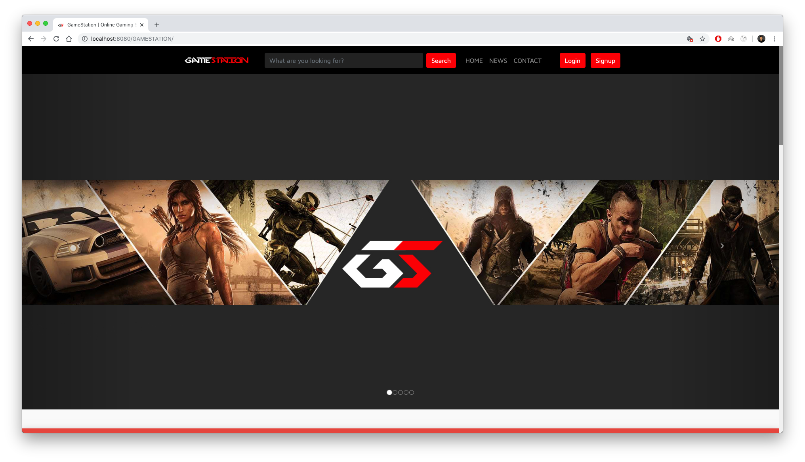
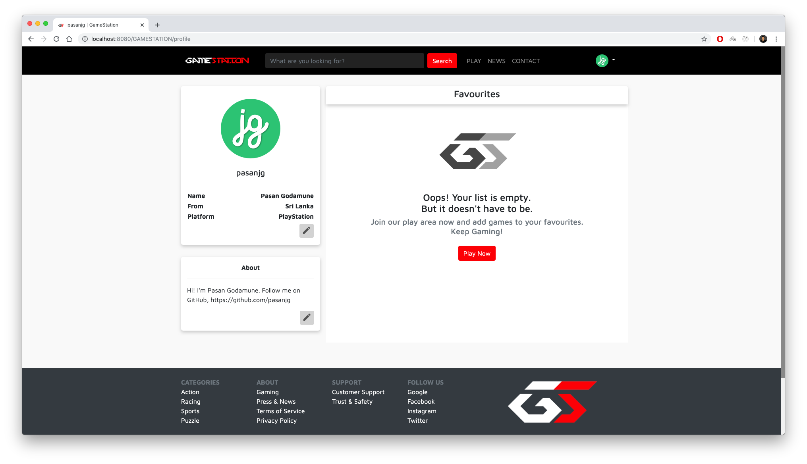

# JSP/SERVLET WEB APPLICATION
### Download 

- [Eclipse JEE](https://www.eclipse.org/downloads/)
- [Tomcat](https://tomcat.apache.org/download-80.cgi)
- [XAMPP](https://www.apachefriends.org/download.html)

This project is developed using Eclipse JEE. Download and install the required applications from the above links.

More updates are yet to come :heart_eyes:

### Steps
##### 1. Clone GameStation

    git clone https://github.com/pasanjg/GAMESTATION.git

##### 2. Import `gamestation.sql` to phpMyAdmin.

##### 3. Open project with Eclipse JEE.

##### 4. Initialize TomCat Server.

##### 5. Run on Server.

### Credentials

| Username | Password |
| -------- | -------- |
| admin    | admin    |
| pasan    | 12345678 |
| bruce    | 123      |

### Screenshots

