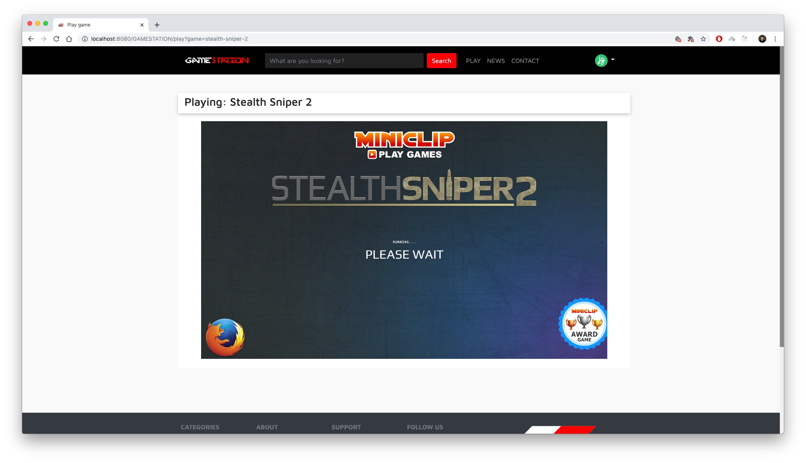

# JSP/SERVLET WEB APPLICATION
Improved version of the second year project. Initial version is available at [`gamestation-v1`](https://github.com/pasanjg/GAMESTATION/tree/gamestation-v1) branch :see_no_evil:

### Download 

- [Eclipse JEE](https://www.eclipse.org/downloads/)
- [Tomcat](https://tomcat.apache.org/download-80.cgi)
- [XAMPP](https://www.apachefriends.org/download.html)

This project is developed in JSP/Servlet (Java) using Eclipse JEE. Download and install the required applications from the above links.

More updates are yet to come :heart_eyes:

### Steps
##### 1. Clone GameStation

    git clone https://github.com/pasanjg/GAMESTATION.git

##### 2. Import [`gamestation.sql`](gamestation.sql) to phpMyAdmin.

##### 3. Open project with Eclipse JEE.

##### 4. Setup and initialize Tomcat Server.

##### 5. Run on Server.

### Credentials

| Username | Password |
| -------- | -------- |
| admin    | admin    |
| pasanjg  | 12345678 |
| bruce    | 123      |

### Screenshots

- ##### Home

- ##### Profile

- ##### Search Results

- ##### Settings

- ##### Play Game

- ##### Edit Games (Admin)
